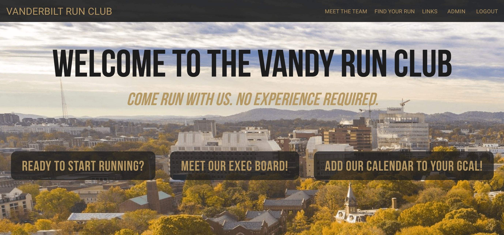

# Vanderbilt Run Club Web Application
The client for the project is the Vanderbilt Run Club and the project itself is a web
application for the club to collect and report information in one standard location. For
background, the run club at Vanderbilt meets 5 days per week from 4:30-5:30 pm to
hold running practices in the Vanderbilt area. The main portion of this project will be to
create a search-able archive of running routes endorsed by the running club. Users of
the application will be able to input runs, tagging the route's main characteristics, so that
others can search for runs in the area.

# Demo Video

[](https://www.youtube.com/watch?v=7IFUI08kbqI)

# Technical Details
MERN fullstack application:
- MangoDB Atlas database
- Express JS backend framework
- Node JS backend environment
- React JS web portal frontend

Tools Utilized:
- Cloudinary image hosting API 
- ArcGIS routing API
- OpenLayers React map package
- Google OAuth 2.0

# Developer Info

Install all dependencies 

```
npm install
```

Install OpenLayers

```
npm install ol --save
```

Run server and client

```
npm start
```
which will launch the client code in the browser. Put http://localhost:3000 into the browser to access.

Building for production

checkout to the prod branch merge main into prod. Make sure production variable is set to true. Build react app by running
```
npm run build
```
Then push to prod which will trigger a heroku deployment of the server derictory of prod branch

# Testing info

Install Testing suite - jest 
```
npm install --save-dev jest
```
In order to run tests:
1. cd into the testing directory from command line
2. run the following command: 
```
npm test
```
IF THIS DOES NOT WORK
1. go to package.json 
2. in the "scripts" section, add: "test": "jest"
3. make sure to save all files before running
